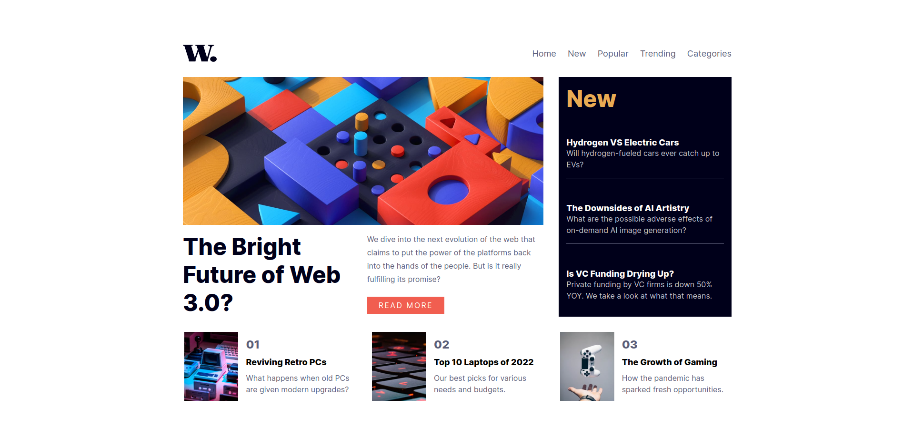

# Frontend Mentor - News homepage solution

This is a solution to the [News homepage challenge on Frontend Mentor](https://www.frontendmentor.io/challenges/news-homepage-H6SWTa1MFl)

## Table of contents

- [Overview](#overview)
  - [The challenge](#the-challenge)
  - [Screenshot](#screenshot)
  - [Links](#links)
- [My process](#my-process)
  - [Built with](#built-with)
  - [Continued development](#continued-development)
  - [Useful resources](#useful-resources)
- [Author](#author)

## Overview

### The challenge

Users should be able to:

- View the optimal layout for the interface depending on their device's screen size
- See hover and focus states for all interactive elements on the page

### Screenshot

### Links

- [Solution](https://www.frontendmentor.io/solutions/news-homepage-i7S4VfLGJk)

- [Live Site](https://mikhail-gulak.github.io/news-homepage/)

## My process

### Built with

- Semantic HTML5 markup
- CSS custom properties
- Flexbox
- CSS Grid
- Mobile-first workflow

### Continued development

This project showed me how important might be essentials: inheritance , cascading and etc. - all that stuff can make your code smaller, more clean and understandable. While working with main section and recommendations i've noticed a kind of advanced topics i want to work with like responsive gaps or sizing. My next steps will be focused on repeating and practice.

### Useful resources

- [CSS Grid Guide](https://css-tricks.com/snippets/css/complete-guide-grid/) - This helped me to understand how grids and their properties work in general. It is extremely useful for beginners like me.

## Author

- Frontend Mentor - [@midjiro](https://www.frontendmentor.io/profile/midjiro)
